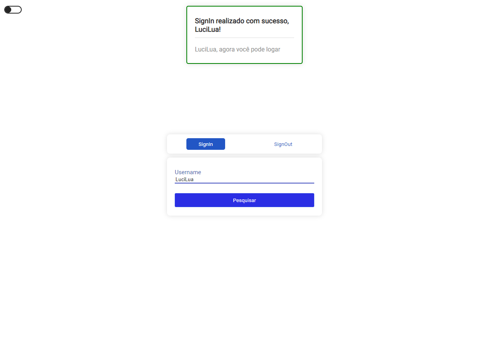

# <p align="center">:octocat: GitHub Info :octocat:</p>

<p align="center">See information about your profile on github</p>

<h1 align="center">
 
  

## 🛠 Technologies used

  


## 🚀 How to start

If you want to learn a little about how this application is being built, as well as the technologies used, take a look at this topic, please pay attention to the MIT license and its limitations, good studies! Feel free to mark insues in this repository too

### 📌 Requirement

> node package manager (NPM or YARN)

> Git bash (optional, you can download the code directly from GitHub at 'code' > 'Download zip')

### ✨ Now are you ready to start

> clone the repository

```bash
git clone https://github.com/LuciLua/apigithub.git
```

> open project folder

```bash
cd ./apigithub
```

> install all packages using npm or yarn manager (using YARN)

```bash
yarn
```

> start the development server (using YARN)

```bash
yarn dev
```

### 🏗 Build

> to make a build (using YARN)

```bash
yarn build
```

> to start the server in production-ready mode (using YARN)

```bash
yarn start
```

## 👥 Making code concise if you make changes

> check if there is anything to change

```bash
yarn lint
```

> still using prettier, have it format the code automatically

```bash
yarn format
```

## 🖼 Preview

**So far, this is the preview, but you can check it out at [this updated link](https://socialmusic.vercel.app/)**


